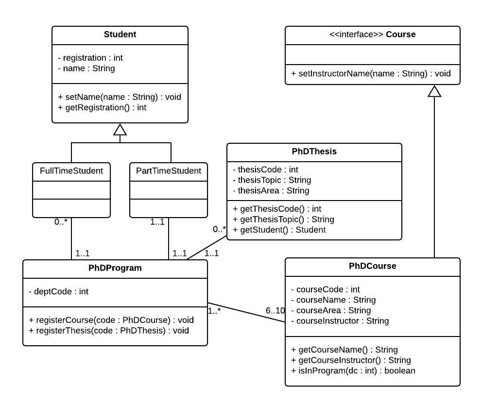

# Software Engineering Fundamentals - Lab #2: Basic Design

**Time:** 30 minutes

**Weighting:** 13.5

This assessment is part of the _individual assessments_ of the course. There are 5 of them, but we only count the _best 4 out of 5_. That means that the worst result won't be taken into account.

Also, you cannot sit the assessment twice: you _must_ sit for the assessment during your corresponding tutorial class.


## Introduction

This assessment evaluates the following CLOs:

- CLO 1: Explain and apply the main aspects of software engineering.
- CLO 3: apply the process of analysis and design using the object-oriented approach
- CLO 5: communicate effectively with others, especially regarding the progress of the system development and the content of the design by means of reports and presentations.

The following topics are assessed:

- UML Diagrams (Class, Sequence, Activity, State).
- Modelling principles. 
- Information and behaviour modelling.


## Instructions

Once you accept the assignment, your own private repository will be created. You must clone it to your computer. Then, work there, and once you are finish, open a git command window, and perform the following:

```
git add -A
git commit -m "Solving assessment"
git push origin master
```


### Case: Students
You are given the following Class Diagram:



Answer the following questions by writing them in a new file on the root of your repo, named `ANSWERS.md`. Always use the following template to answer each question, replacing the number for corresponding one:

```
# 1
My answer is this
```

0. Create a new folder named `code`, and code the classes. Methods should be empty or return a dummy value (empty String `""`, or `1`, or `0.0`, depending on its return value). _(No need to add this one in the Answers file)_.

1. What methods does `FullTimeStudent` has?

2. How many `PhDThesis` can a `PartTimeStudent` have? Explain your reasoning.

3. What change will do you if you _don't_ want any instances of `Student`? Why?

4. A new class `HDRManager` wants to assign a thesis to a student in a program through a new method.  

    - Create the sequence diagram (consider creating the thesis as well). It needs to match the class diagram classes and existing attributes, but... (read next bullet points).
  
    - You must also alter the Class diagram to add attributes/methods (and the new class) required to complete the required call.
  
    - Add the altered attributes/methods/classes in _green colour_.


## 3 Minutes Presentation

- On the tutorial following the week of the assessment, the tutors will schedule a 4  minutes video-conference with each student. 

- Most of these will be allocated during tutorial time, the rest will have to be scheduled at a different time.

- During that session, each student will present a 3 minutes explanation (online, sharing their screen and showing the assessment -not slides-) showcasing what they did to solve the assignment and their reasoning.

- During this presentation, the tutor will not ask any further question.

- We will check for duplicated 3min speeches. No plagiarism is allowed.

- Presentations will be recorded by the tutor and kept privately.

- _The marking will be done in terms of what was explained and a quick double-check of the code. Please explain everything that is addressed on the Rubric._

- **If the student fails to attend the allocated video-conference slot, they will obtain no marks for the assessment.**


## Rubric

| HD     | DI      | CR      | PA      | F      |
| ------ | ------- | ------- | ------- | ------ |
| Diagrams are submitted and accurate to the code. There are no conflicts between diagrams. Classes are complete with methods. Relationships are all correct. Naming is accurate. All questions are clear and correctly answered. | Both diagrams submitted and there are few innacuracies (i.e. one is perfect but the other not, or minor inaccuracies). There are no conflicts between diagrams. Classes are complete with methods. Relationships are all correct. Naming is accurate. All questions are answered correctly, at the most two of them incomplete. Or explanation is not clear enough/confusing/too long. | The sequence diagram has some innacuracies. The class diagram has some innacuracies. There are few conflicts between class and sequence diagram.Classes are complete with methods and attributes. Some relationships are wrong. Naming is mostly accurate. At least two questions are complete, or the th ree of them are incomplete. | The sequence diagram is incomplete. The class diagram is incomplete. Naming conventions are inaccurate. There are some/many conflicts between the class and sequence diagram. Classes are incomplete with some methods and attributes. Some attributes/methods are wrong, and some relationships are wrong. Naming may be ocassionally. At least one of the questions is correct. | Code not submitted or completely incorrect. Questions not answered or incorrect. |