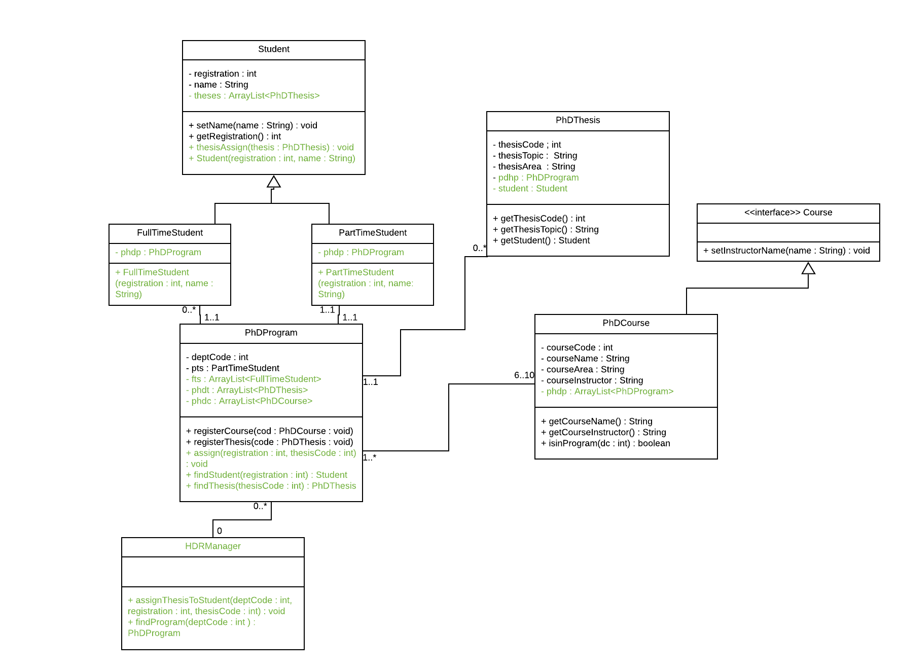
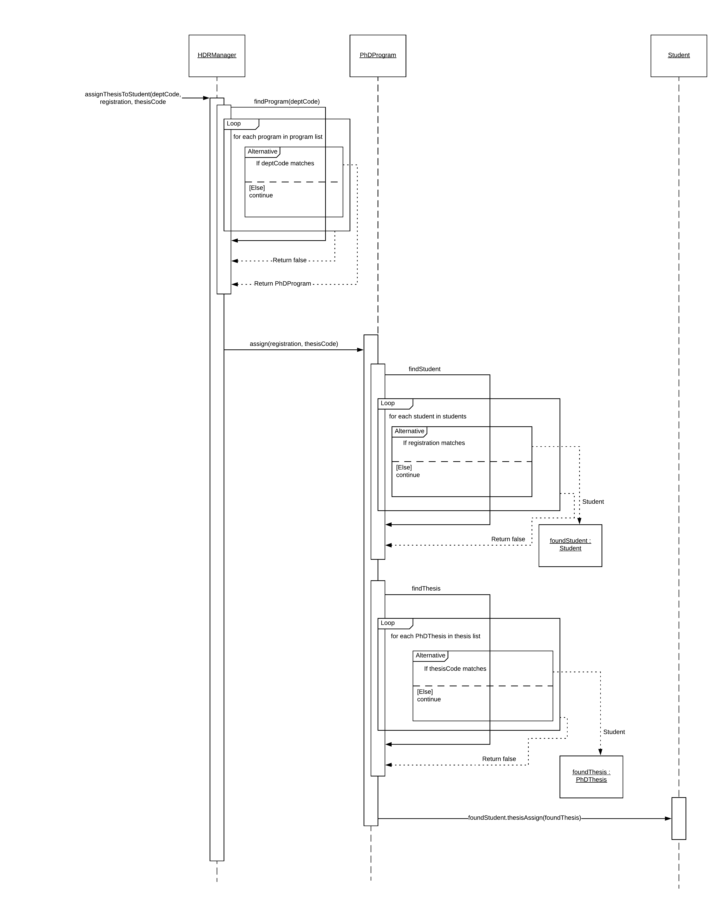

#1
The FullTimeStudent inherits all the methods from its parent class, thus it has getRegistration and setName, though not visible in the class itself (since they aren't being overridden). It does not have any methods that the superclass does not.

#2
A PartTimeStudent has one and only one PhDProgram (1..1) and a PhDProgram has zero to many PhDThesis'. 
Thus, I have deduced that a student can have zero to many PhDThesis' due to transitive property. This means that if a PartTimeStudent has one PhDProgram and one PhDProgram has 0 to many PhDThesis', then a PartTimeStudent also has 0 to many PhDThesis'.

#3
Convert the Student class to realisation. This is because the Student class currently is a parent class, and converting the Student class to an interface it then cannot be instantiated.

#4

